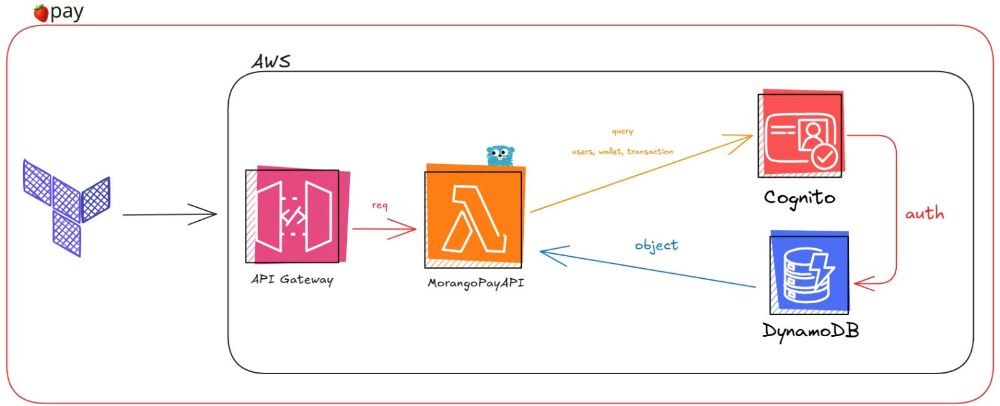

# MoranGo Pay 🍓💳

A serverless payment platform built with Go and AWS.

## 🚀 How it Works

MoranGo Pay is a **serverless event-driven application** that allows users to:
- Create accounts and authenticate
- Manage digital wallets
- Process transactions (deposits, payments, transfers)
- View transaction history

The app uses **AWS Lambda** to handle business logic and **DynamoDB** to store data, all protected by **JWT authentication**.

## ☁️ AWS Services Used

- **API Gateway v2** - HTTP API endpoints
- **Lambda** - Go runtime for business logic
- **Cognito** - User authentication & JWT tokens
- **DynamoDB** - Database (single table design)
- **S3** - Terraform state storage



## 📡 API Routes

### Authentication (No JWT Required)

#### `POST /auth/register`
Create new user account.
```json
{
  "username": "user@email.com",
  "password": "password123",
  "email": "user@email.com"
}
```

#### `POST /auth/confirm`
Confirm registration with code from email.
```json
{
  "email": "user@email.com"
}
```

#### `POST /auth/login`
Login and get JWT token.
```json
{
  "email": "user@email.com",
  "password": "password123"
}
```

### Wallet Operations (JWT Required)

**Headers needed:**
```
Authorization: Bearer <JWT_TOKEN>
Content-Type: application/json
```

#### `GET /wallet/{userID}`
Get wallet balance and info.

#### `POST /wallet/{userID}/transaction`
Create new transaction.
```json
{
  "type": "deposit",
  "amount": 100.50,
  "description": "Salary deposit"
}
```

#### `GET /wallet/{userID}/transactions`
Get user's transaction history.
```
GET /wallet/user123/transactions?limit=50
```

#### `GET /wallet/{transactionID}/transaction`
Get specific transaction details.

## 💰 Transaction Types

- `deposit` - Add money
- `withdrawal` - Remove money  
- `transfer` - Move between wallets
- `payment` - Pay for goods/services
- `receipt` - Receive payment
- `refund` - Return money
- `credit` - Credit operation
- `debit` - Debit operation

## 🧪 Testing

### 1. Get JWT Token
```bash
# Register user
POST /auth/register
# Check email for confirmation code
POST /auth/confirm  
# Login to get token
POST /auth/login
```

### 2. Use Token
```bash
# Add to headers
Authorization: Bearer <JWT_TOKEN>

# Test wallet operations
GET /wallet/user123
POST /wallet/user123/transaction
GET /wallet/user123/transactions
```

## 🗄️ How Data is Stored

**DynamoDB Single Table:**
- **PK:** `WALLET#<walletID>`
- **SK:** `TRANSACTION#<timestamp>#<id>`
- **GSI1:** Find transactions by user
- **GSI2:** Find transaction by ID

## 🛠️ Project Structure

```
app/
├── cmd/api/          # Main app entry
├── internal/         # Business logic
│   ├── delivery/     # HTTP handlers
│   ├── domain/       # Data models
│   ├── usecase/      # Business rules
│   └── infra/        # Database access
└── terraform/        # AWS infrastructure
```

## 🚀 Quick Start

1. **Deploy AWS resources:**
   ```bash
   cd terraform
   terraform init && terraform apply
   ```

2. **Build & deploy Lambda:**
   ```bash
   cd app
   make build && make deploy
   ```

3. **Test the API endpoints**

---

**Built with Go + AWS Lambda + DynamoDB 🍓**

